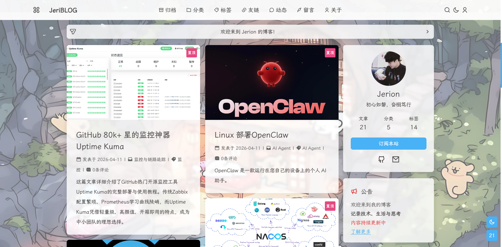
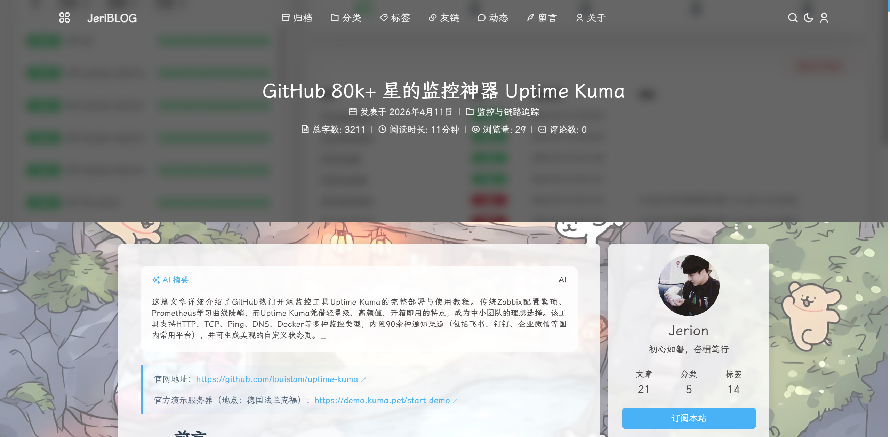
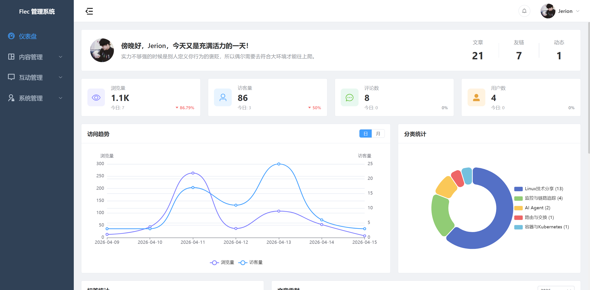
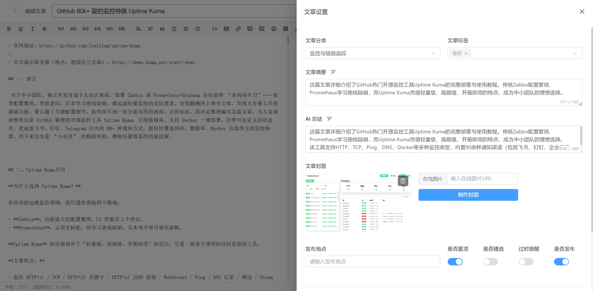

# JeriBlog

一个有审美、有边界感的现代化全栈博客系统。基于 https://github.com/talen8/FlecBlog.git 二次开发。

原作者博客：https://blog.talen.top

## 目录

- [一、项目介绍](#一项目介绍)
- [二、环境要求](#二环境要求)
- [三、本地开发快速启动](#三本地开发快速启动)
- [四、Docker Compose 快速部署（推荐）](#四docker-compose-快速部署推荐)
- [五、生产环境部署](#五生产环境部署)
- [六、API 文档](#六api-文档)
- [八、许可证](#七许可证)
- [九、致谢](#八致谢)
- [十、联系方式](#九联系方式)

# 一、项目介绍

## 1.1 关于

JeriBlog 是一个三端分离的博客系统，围绕内容创作这件事，做了相对完整的一套产品闭环。

把前台博客、后台管理、后端服务拆分成清晰的三个部分，让内容系统既能保持表现力，也能维持长期可维护性。

| 模块 | 技术栈 | 定位 |
| --- | --- | --- |
| `server` | Go 1.25 / Gin / GORM / PostgreSQL | 后端服务、认证、接口、数据与定时任务 |
| `admin` | Vue 3 / Element Plus / Vite | 内容管理、仪表盘、编辑器、运营后台 |
| `blog` | Nuxt 4.2.2 / Vue 3 / SCSS | 博客前台、SSR、SEO、阅读体验 |

**为什么选择 JeriBlog**

- 有完整工程结构，而不是只做出一个页面展示
- 管理端与博客端解耦，前后台体验更纯粹
- 支持文章、评论、友链、统计等博客常见能力
- 适合个人品牌博客，也适合继续扩展成内容型产品

## 1.2 预览

| 博客加载页 | 博客主页 |
| --- | --- |
|  |  |

| 博客首页 | 文章详情 |
| --- | --- |
|  |  |

| 后台仪表盘 | 后台编辑器 |
| --- | --- |
|  |  |

## 1.3 技术栈

### 1.3.1 Server - 服务端

- **语言**: [Go 1.25](https://golang.org)
- **框架**: [Gin](https://github.com/gin-gonic/gin)
- **ORM**: [GORM](https://gorm.io)
- **数据库**: PostgreSQL
- **认证**: JWT (JSON Web Tokens), OAuth2, Goth
- **API 文档**: Swagger
- **定时任务**: [Cron](https://github.com/robfig/cron)
- **其他**: User-Agent 解析, 飞书 SDK, 微信公众号

### 1.3.2 Admin - 管理端

- **框架**: [Vue 3](https://vuejs.org) + [Vite](https://vitejs.dev)
- **UI 组件**: [Element Plus](https://element-plus.org)
- **状态管理**: [VueUse](https://vueuse.org)
- **Markdown 编辑器**: CodeMirror 6
- **图表**: ECharts, echarts-wordcloud
- **其他**: TypeScript, Vue Router, Axios, dayjs, SCSS

### 1.3.3 Blog - 博客端

- **框架**: [Nuxt 4](https://nuxt.com) - Vue.js 全栈框架
- **文章渲染**: markdown-it, Highlight.js, Mermaid
- **样式**: SCSS
- **SEO**: @nuxtjs/seo, Sitemap, Atom Feed
- **PWA**: @vite-pwa/nuxt
- **其他**: TypeScript, VueUse, dayjs, Lenis, medium-zoom, APlayer

## 1.4 目录结构

### 1.4.1 Server - 后端服务

```bash
server/
├── api/                     # API 层
│   ├── middleware/          # 中间件 (认证、CORS、日志、限流、RBAC)
│   ├── router/              # 路由配置
│   └── v1/                  # API v1 接口 (文章、用户、评论、标签、分类、友链、动态、菜单、通知、反馈、订阅、RSS、AI、系统)
├── cmd/                     # 应用入口
│   └── main.go              # 主程序入口
├── config/                  # 配置管理
├── docs/                    # Swagger API 文档
├── internal/                # 内部业务逻辑
│   ├── dto/                 # 数据传输对象 (Data Transfer Object)
│   ├── model/               # 数据模型 (GORM 实体)
│   ├── repository/          # 数据访问层 (Repository Pattern)
│   └── service/             # 业务逻辑层 (Service Layer)
├── pkg/                     # 可复用的公共包
│   ├── database/            # 数据库连接管理
│   ├── email/               # 邮件发送服务
│   ├── errcode/             # 统一错误码定义
│   ├── feishu/              # 飞书 SDK 封装
│   ├── logger/              # 日志工具
│   ├── notification/        # 通知服务聚合 (邮件/飞书)
│   ├── response/            # 统一响应格式
│   ├── scheduler/           # 定时任务调度器
│   ├── upload/              # 文件上传管理 (本地/MinIO/OSS/COS/七牛云)
│   └── utils/               # 通用工具函数
├── templates/               # 邮件等模板文件
├── go.mod                   # Go 模块依赖
└── Dockerfile               # Docker 镜像构建文件
```

### 1.4.2 Admin - 管理后台

```bash
admin/
├── src/
│   ├── api/                 # API 接口封装
│   ├── assets/              # 静态资源 (图片、字体、样式)
│   ├── components/          # 公共组件
│   │   ├── common/          # 通用组件 (表格、表单、对话框)
│   │   └── editor/          # Markdown 编辑器组件
│   ├── layouts/             # 页面布局组件
│   ├── router/              # Vue Router 路由配置
│   ├── types/               # TypeScript 类型定义
│   ├── utils/               # 工具函数 (日期、验证、请求)
│   ├── views/               # 页面组件
│   │   ├── article/         # 文章管理
│   │   ├── comment/         # 评论管理
│   │   ├── dashboard/       # 仪表盘
│   │   ├── friend/          # 友链管理
│   │   ├── moment/          # 动态管理
│   │   ├── rssfeed/         # RSS 订阅管理
│   │   ├── system/          # 系统设置
│   │   └── user/            # 用户管理
│   ├── App.vue              # 根组件
│   └── main.ts              # 应用入口
├── public/                  # 公共静态文件
├── index.html               # HTML 模板
├── vite.config.ts           # Vite 构建配置
├── nginx.conf               # Nginx 配置
├── package.json             # npm 依赖
└── Dockerfile               # Docker 镜像构建文件
```

### 1.4.3 Blog - 博客前台

```bash
blog/
├── app/                     # 应用主目录
│   ├── assets/              # 静态资源 (样式、图片)
│   ├── components/          # Vue 组件
│   │   ├── article/         # 文章相关组件
│   │   ├── comment/         # 评论组件
│   │   ├── layout/          # 布局组件 (头部、底部、侧边栏)
│   │   └── widget/          # 小部件 (标签云、归档、友链)
│   ├── composables/         # 组合式函数 (Composables)
│   ├── layouts/             # 页面布局
│   ├── pages/               # 页面路由 (基于文件系统)
│   │   ├── article/         # 文章页面
│   │   ├── category/        # 分类页面
│   │   ├── tag/             # 标签页面
│   │   ├── friend/          # 友链页面
│   │   └── about/           # 关于页面
│   ├── plugins/             # Nuxt 插件
│   ├── utils/               # 工具函数
│   └── app.vue              # 根组件
├── public/                  # 公共静态文件
├── server/                  # 服务端代码 (SSR)
│   ├── plugins/             # 服务端插件
│   └── routes/              # API 路由
├── types/                   # TypeScript 类型定义
├── nuxt.config.ts           # Nuxt 配置
├── package.json             # npm 依赖
└── Dockerfile               # Docker 镜像构建文件
```

## 1.5 特性

### 1.5.1 SSR 服务端渲染

Blog 端采用 Nuxt 4 的 SSR 模式，提供：

- 更好的 SEO 优化，搜索引擎可直接抓取完整内容
- 更快的首屏加载速度
- 更好的用户体验

### 1.5.2 SEO 优化

集成完整的 SEO 功能：

- 动态 sitemap.xml
- robots.txt
- Atom Feed 订阅
- Open Graph 标签
- 结构化数据

### 1.5.3 API 文档

服务启动后，访问以下地址查看 API 文档：

```bash
http://localhost:8080/swagger/index.html
```

## 1.6 理念

JeriBlog 想做的不是“更复杂”，而是“更完整”。

简约，不是把内容做空。 高级，也不是故作夸张。

它更像一个安静但可靠的内容容器， 适合长期写作，也适合慢慢生长出自己的品牌风格。

## 1.7 注意事项

### 1.7.1 信任代理配置

在容器化部署环境下（如 Docker），后端服务需要正确配置信任代理范围才能获取真实客户端 IP 地址。

**问题场景**：
- 使用 Docker 网络时，客户端 IP 可能显示为容器网关地址（如 172.170.0.1）
- Nginx 反向代理传递的 `X-Forwarded-For` 头部无法被正确解析

**解决方案**：

在 `server/api/router/router.go` 中配置 `SetTrustedProxies`，确保包含您的 Docker 网络段：

```go
// 示例：Docker 使用 172.170.0.0/24 网段
r.SetTrustedProxies([]string{
    "127.0.0.1",
    "172.0.0.0/8",      // 包含所有 172.x.x.x 网段（推荐）
    "10.0.0.0/8",
    "192.168.0.0/16",
})
```

**常见 Docker 网络段**：
- 默认 bridge 网络：`172.17.0.0/16`
- 自定义网络：`172.16.0.0/12` 或 `172.0.0.0/8`（更宽泛）

**验证方法**：
1. 查看 Docker 网络配置：`docker network inspect <network_name>`
2. 检查容器日志中的 IP 地址是否为真实客户端 IP
3. 确保信任代理范围覆盖 Docker 网关地址

### 1.7.2 文章支持在线视频嵌入

博客支持在 Markdown 文章中嵌入 B 站、YouTube 和本地视频。

**使用方法**：

**B 站视频**：
```markdown
:::video bilibili BV1xx411c7mD :::
```

**YouTube 视频**：
```markdown
:::video youtube dQw4w9WgXcQ :::
```

**本地/在线视频**：
```markdown
:::video https://example.com/video.mp4 :::
```

**注意事项**：
- B 站视频需要提供 BV 号（如 `BV1xx411c7mD`）
- YouTube 视频需要提供视频 ID（如 `dQw4w9WgXcQ`）
- 本地视频需要先上传到服务器或使用在线视频链接
- 视频会自动适配响应式布局，支持移动端播放

### 1.7.3 Swagger 文档生成

后端使用 Swagger 自动生成 API 文档。当修改 API 接口注释后，需要重新生成文档。

**安装 swag 工具**：

首次使用前需要安装 swag 命令行工具：

```bash
# 方式1：使用 go install（推荐，Go 1.16+）
go install github.com/swaggo/swag/cmd/swag@latest

# 方式2：使用 go get（Go 1.16 以下版本）
go get -u github.com/swaggo/swag/cmd/swag

# 验证安装
swag --version
```

**生成命令**：

```bash
# 进入 server 目录
cd server

# 生成 Swagger 文档
swag init -g cmd/main.go -o docs --parseDependency --parseInternal
```

**参数说明**：
- `-g cmd/main.go`：指定主入口文件
- `-o docs`：指定文档输出目录
- `--parseDependency`：解析依赖包中的类型定义
- `--parseInternal`：解析 internal 包中的类型定义

**注意事项**：
- 修改 API 注释后必须重新生成文档
- 确保注释中引用的类型已正确导入
- 生成的文档文件位于 `server/docs/` 目录
- 如果 `swag` 命令不可用，请确认 `$GOPATH/bin` 或 `$GOBIN` 已添加到系统 PATH 环境变量中

# 二、环境要求

| 依赖       | 版本要求            |
| ---------- | ------------------- |
| Go         | >= 1.25 (server)    |
| Node.js    | >= 20 (admin, blog) |
| PostgreSQL | >= 12 (server)      |

# 三、本地开发快速启动

## 3.1 环境要求

- **Node.js** >= 20 (admin, blog)
- **Go** >= 1.25 (server)
- **PostgreSQL** >= 12 (server)

> 如果本地没有安装部署 PostgreSQL，可参考以下docker快速部署相关数据库（可选）。

创建 `pgsql` 指令：

```bash
docker run -d --name pg-prod \
  -p 5432:5432 \
  -v /data/PgSqlData:/var/lib/postgresql/data \
  -e POSTGRES_PASSWORD="123456ok!" \
  -e LANG=C.UTF-8 \
  -e TZ=Asia/Shanghai \
  postgres:17-alpine
```

查看是否创建成功：

```bash
[root@docker-server ~]# docker ps
CONTAINER ID   IMAGE                COMMAND                  CREATED          STATUS          PORTS                                         NAMES
22205f8e78c6   postgres:17-alpine   "docker-entrypoint.s…"   34 minutes ago   Up 34 minutes   0.0.0.0:5432->5432/tcp, [::]:5432->5432/tcp   pg-prod
```

## 3.2 克隆项目

```bash
git clone https://github.com/zyx3721/JeriBlog.git /data/myBlog
cd /data/myBlog
```

## 3.3 数据库配置

### 3.3.1 本地数据库创建

创建 PostgreSQL 数据库：

```bash
psql -Upostgres -c " \
  CREATE DATABASE blogdb \
  WITH OWNER = postgres \
    ENCODING = 'UTF8' \
    LC_COLLATE = 'en_US.UTF-8' \
    LC_CTYPE = 'en_US.UTF-8' \
    TEMPLATE = template0;"
```

### 3.3.2 容器数据库创建

进入容器内的 psql 交互界面：

```bash
docker exec -it pg-prod psql -U postgres
```

在 psql 中创建 blogdb 库（执行后输入 `\q` 退出）：

```bash
CREATE DATABASE blogdb
WITH OWNER = postgres
  ENCODING = 'UTF8'
  LC_COLLATE = 'en_US.UTF-8'
  LC_CTYPE   = 'en_US.UTF-8'
  TEMPLATE   = template0;
```

应用会在首次启动时自动执行 `pkg/database/sql/init_database.sql` 初始化数据库，包括创建表结构和初始数据。

> ⚠️ **PostgreSQL 15+ 权限配置**：如果使用 PostgreSQL 15 或更高版本，且数据库用户不是 `postgres`（超级用户），需要额外配置 schema 权限：
>
> ```bash
> sudo -i -u postgres
> psql -U postgres -d <数据库名> -c "GRANT CREATE ON SCHEMA public TO <用户名>;"
> ```
>
> PostgreSQL 15+ 默认限制了普通用户在 public schema 上的创建权限，上述命令会授予必要的权限。

## 3.4 后端配置与启动

> 如果没有配置go的镜像代理，可以参考 [Go 国内加速：Go 国内加速镜像 | Go 技术论坛](https://learnku.com/go/wikis/38122)。

1. 进入后端目录下载相关依赖：

```bash
cd server
go mod download
```

2. 配置数据库连接等信息：

```bash
# 步骤1：复制模板文件
cp env.example .env

# 步骤2：编辑 .env，配置数据库连接等信息
vim .env
# 服务器配置
SERVER_PORT=8080
SERVER_ALLOW_ORIGINS=*

# 数据库配置
DB_HOST=localhost
DB_PORT=5432
DB_NAME=postgres
DB_USER=postgres
DB_PASSWORD=your_database_password

# JWT 配置
JWT_SECRET=your_jwt_secret_key
```

3. 修改 `router.go` 文件：

```bash
# 添加允许本机 127.0.0.1 地址访问
sed -i 's@r\.SetTrustedProxies(\[\]string{"10.0.0.0/8", "172.16.0.0/12", "192.168.0.0/16"})@r.SetTrustedProxies([]string{"127.0.0.1", "10.0.0.0/8", "172.16.0.0/12", "192.168.0.0/16"})@g' api/router/router.go
```

4. 运行后端服务：

```bash
# 方式1：前台运行（终端关闭则服务停止）
go run cmd/main.go

# 方式2：后台运行（日志输出到 app.log）
nohup go run cmd/main.go > app.log 2>&1 &
```

后端服务默认运行在 `http://localhost:8080` ，如需指定端口，请修改环境变量文件内的 `SERVER_PORT` 参数。首次启动会自动创建数据库和默认管理员账户 `admin@example.com / 123456` 。

## 3.5 Admin 前端配置与启动

1. 进入前端目录下载相关依赖：

```bash
cd admin
npm install
```

2. 配置 API 地址（可选）：

```bash
# 配置说明：
# - 后端端口 = 8080：无需创建 .env 文件（默认值为 http://localhost:8080/api/v1）
# - 后端端口 ≠ 8080：需要创建 .env 文件（指定正确端口，例如后端端口改为 8090）
#   创建 .env 文件，例如：
echo "VITE_API_URL=http://localhost:8090/api/v1" > .env
```

3. 修改 `config.js` 文件（可选）：

```bash
# 配置说明：
# - 后端端口 = 8080：无需修改（默认值为 http://localhost:8080/api/v1）
# - 后端端口 ≠ 8080：需要修改（指定正确端口，例如后端端口改为 8090）
#   修改 config.js 文件，例如：
cat > public/config.js <<EOF
window.__APP_CONFIG__ = {
  apiUrl: "http://localhost:8090/api/v1"
};
EOF
```

4. 启动前端服务：

```bash
# 方式1：前台运行（终端关闭则服务停止）
npm run dev

# 方式2：后台运行（日志输出到 admin-frontend.log）
nohup npm run dev > admin-frontend.log 2>&1 &
```

Admin 前端服务默认运行在 `http://localhost:5174/admin/` 。

## 3.6 Blog 前端配置与启动

1. 进入前端目录下载相关依赖：

```bash
cd blog
npm install
```

2. 配置 API 地址（可选）：

```bash
# 配置说明：
# - 后端端口 = 8080：无需创建 .env 文件（默认值为 http://localhost:8080/api/v1）
# - 后端端口 ≠ 8080：需要创建 .env 文件（指定正确端口，例如后端端口改为 8090）
#   创建 .env 文件，例如：
echo "NUXT_PUBLIC_API_URL=http://localhost:8090/api/v1" > .env
```

3. 启动前端服务：

```bash
# 方式1：前台运行（终端关闭则服务停止）
npm run dev

# 方式2：后台运行（日志输出到 blog-frontend.log）
nohup npm run dev > blog-frontend.log 2>&1 &
```

Blog 前端服务默认运行在 `http://localhost:3000` 。

## 3.7 访问系统

- **博客端**：`http://localhost:3000`
- **管理端**：`http://localhost:5174/admin/`
  - **默认管理员账户**：`admin@example.com`
  - **默认管理员密码**：`123456`
- **API 文档**：`http://localhost:8080/swagger/index.html`

# 四、Docker Compose 快速部署（推荐）

## 4.1 部署目录结构

所有相关文件统一放在 `deploy/` 目录下，单镜像包含前端（Nginx）、后端（blog-backend），通过 supervisord 管理多进程。

```bash
deploy/
├── docker-compose.yml    # 服务编排配置
├── .env                  # 环境变量（需自行创建，见 4.2）
├── .env.example          # 环境变量模板 
├── BlogData/             # 应用持久化数据（首次启动自动创建）
│   ├── uploads/          # 上传文件
│   └── logs/             # 运行日志
└── PgSqlData/            # PostgreSQL 数据（首次启动自动创建）
```

## 4.2 准备配置文件

进入 `deploy` 目录，创建 `.env` 环境变量文件：

```bash
cd deploy
vim .env
```

`.env` 文件内容参考：

```bash
# 数据库配置
DB_HOST=postgres
DB_PORT=5432
DB_NAME=blogdb
DB_USER=postgres
DB_PASSWORD=your_database_password

# 默认留空，外部有 HTTPS 反代时设置为 https
SERVER_SCHEME=https

# JWT 配置
JWT_SECRET=your_jwt_secret_key

# 博客前台 Nuxt SSR 服务端渲染时使用（填写你的域名或IP）
NUXT_PUBLIC_API_URL=https://your-domain.com/api/v1

# 管理后台 config.js 注入的 API 地址（填写你的域名或IP）
API_URL=https://your-domain.com/api/v1
```

## 4.3 构建镜像（可选）

如果不想使用阿里云镜像仓库的镜像，可直接在本地手动构建（默认使用阿里云镜像仓库地址）：

```bash
# 在 deploy/ 目录下构建（构建上下文为项目根目录）
cd deploy
docker build -t jeriblog:latest -f Dockerfile ..
```

然后修改 `deploy/docker-compose.yml` 中 `jeriblog` 服务的 `image` 字段为 `jeriblog:latest` 。

## 4.4 启动服务

`docker-compose.yml` 支持两种模式，按需选择：

**模式一：新建 PostgreSQL 容器（默认）**

首次启动会自动创建 `blogdb` 数据库：

```bash
cd deploy
docker compose up -d
```

**模式二：使用已有容器**

`.env` 环境变量文件中确保数据库配置填入已有容器地址，并编辑 `deploy/docker-compose.yml`：

1. 注释掉 `postgres` 服务块
2. 注释掉 `blog.depends_on` 块

```bash
cd deploy
docker compose up -d
```

## 4.5 服务管理

```bash
# 查看服务状态
docker compose ps

# 查看实时日志
docker compose logs -f blog

# 重启 blog 服务
docker compose restart blog

# 停止所有服务
docker compose down

# 停止并删除数据卷（谨慎！数据会丢失）
docker compose down -v
```

## 4.6 访问系统

服务启动后，访问以下地址：

- **博客端**：`https://your-domain.com`
- **管理端**：`https://your-domain.com/admin`
  - **默认管理员账户**：`admin@example.com`
  - **默认管理员密码**：`123456`
- **API 文档**：`https://your-domain.com/swagger/index.html`
- **健康检查**：`https://your-domain.com/health`

## 4.7 宿主机 Nginx 反代（可选）

如需通过宿主机 Nginx 配置 HTTPS，将 `deploy/docker-compose.yml` 中的端口映射改为非 80 端口（如 `8080:80`），再配置外部 Nginx 代理：

### 4.7.1 HTTP 示例

```nginx
server {
    listen 80;
    server_name your-domain.com;
    
    # 限制上传文件大小（可选）
    client_max_body_size 50m;

    location / {
        proxy_pass http://127.0.0.1:8080;
        proxy_http_version 1.1;
        proxy_set_header Upgrade $http_upgrade;
        proxy_set_header Connection "upgrade";
        proxy_set_header Host $host;
        proxy_set_header X-Real-IP $remote_addr;
        proxy_set_header X-Forwarded-For $proxy_add_x_forwarded_for;
        proxy_set_header X-Forwarded-Proto $scheme;
        
        # 超时配置
        proxy_connect_timeout 600s;
        proxy_send_timeout 600s;
        proxy_read_timeout 600s;
    }
}
```

### 4.7.2 HTTPS 实例

> HTTPS 示例（含 80→443 跳转，请替换证书路径）：

```nginx
# HTTP 80端口配置，自动重定向到HTTPS
server {
    listen 80;
    server_name your-domain.com;   # 修改为你的域名/主机名，例如：blog.cn
    return 301 https://$host$request_uri;
}

# blog 站点 HTTPS 配置
server {
    # listen 443 ssl http2;  # Nginx 1.25 以下版本写法
    listen 443 ssl;
    http2 on;
    server_name your-domain.com;   # 修改为你的域名/主机名，例如：blog.cn

    # 证书路径（替换为实际证书文件）
    ssl_certificate     /usr/local/nginx/ssl/your-domain.com.pem;  # 例如：/usr/local/nginx/ssl/blog.cn.pem
    ssl_certificate_key /usr/local/nginx/ssl/your-domain.com.key;  # 例如：/usr/local/nginx/ssl/blog.cn.key
    
    # SSL安全优化
    ssl_protocols              TLSv1.2 TLSv1.3;
    ssl_prefer_server_ciphers  on;
    ssl_ciphers                ECDHE-RSA-AES128-GCM-SHA256:HIGH:!aNULL:!MD5:!RC4:!DHE;
    ssl_session_timeout        10m;
    ssl_session_cache          shared:SSL:10m;
    
    # 限制上传文件大小（可选）
    client_max_body_size 50m;

    ssl_certificate     /path/to/your-domain.com.pem;
    ssl_certificate_key /path/to/your-domain.com.key;
    ssl_protocols       TLSv1.2 TLSv1.3;
    ssl_session_cache   shared:SSL:10m;

    location / {
        proxy_pass http://127.0.0.1:8080;
        proxy_http_version 1.1;
        proxy_set_header Upgrade $http_upgrade;
        proxy_set_header Connection "upgrade";
        proxy_set_header Host $host;
        proxy_set_header X-Real-IP $remote_addr;
        proxy_set_header X-Forwarded-For $proxy_add_x_forwarded_for;
        proxy_set_header X-Forwarded-Proto $scheme;
        
        # 超时配置
        proxy_connect_timeout 600s;
        proxy_send_timeout 600s;
        proxy_read_timeout 600s;
    }
}
```

# 五、生产环境部署

## 5.1 克隆项目

```bash
git clone https://github.com/zyx3721/JeriBlog.git /data/myBlog
cd /data/myBlog
```

## 5.2 后端构建与配置

1. 进入后端目录下载相关依赖：

```bash
cd server
go mod download
```

2. 配置数据库连接等信息：

```bash
# 步骤1：复制模板文件
cp env.example .env

# 步骤2：编辑 .env，配置数据库连接等信息
vim .env
# 服务器配置
SERVER_PORT=8080
SERVER_ALLOW_ORIGINS=*

# 数据库配置
DB_HOST=localhost
DB_PORT=5432
DB_NAME=postgres
DB_USER=postgres
DB_PASSWORD=your_database_password

# JWT 配置
JWT_SECRET=your_jwt_secret_key
```

3. 修改 `router.go` 文件：

```bash
# 添加允许本机 127.0.0.1 地址访问
sed -i 's@r\.SetTrustedProxies(\[\]string{"10.0.0.0/8", "172.16.0.0/12", "192.168.0.0/16"})@r.SetTrustedProxies([]string{"127.0.0.1", "10.0.0.0/8", "172.16.0.0/12", "192.168.0.0/16"})@g' api/router/router.go
```

4. 构建后端可执行文件：

```bash
go build -o blog-backend cmd/main.go
```

5. 运行后端服务： 

```bash
# 方式1：前台运行（终端关闭则服务停止）
./blog-backend

# 方式2：后台运行（日志输出到 app.log）
nohup ./blog-backend > app.log 2>&1 &

# 方法3：加入 systemd 管理启动运行
# 服务配置参考如下，请自行修改相应目录路径
cat > /etc/systemd/system/blog-backend.service <<EOF
[Unit]
Description=Blog Backend Golang Service
After=network.target network-online.target
Wants=network-online.target

[Service]
Type=simple
WorkingDirectory=/data/myBlog/server
ExecStart=/data/myBlog/server/blog-backend
Restart=on-failure
RestartSec=5
LimitNOFILE=65535
StandardOutput=journal
StandardError=journal
SyslogIdentifier=blog-backend

[Install]
WantedBy=multi-user.target
EOF

# 重载服务配置并启动
systemctl daemon-reload
systemctl start blog-backend

# 设置开机自启
systemctl enable --now blog-backend
```

## 5.3 Admin 前端构建与配置

1. 进入前端目录下载相关依赖：

```bash
cd admin
npm install
```

2. 配置 API 地址：

由于后续通过 Nginx 代理访问，因此这里配置为：

```bash
# 配置二选一
## HTTP 方式
echo "VITE_API_URL=http://your-domain.com/api/v1" > .env

## HTTPS 方式（SSL 证书）
echo "VITE_API_URL=https://your-domain.com/api/v1" > .env
```

3. 修改 `config.js` 文件（可选）：

由于后续通过 Nginx 代理访问，因此这里配置为：

```bash
# 配置二选一
## HTTP 方式
cat > public/config.js <<EOF
window.__APP_CONFIG__ = {
  apiUrl: "http://your-domain.com/api/v1"
};
EOF

## HTTPS 方式（SSL 证书）
cat > public/config.js <<EOF
window.__APP_CONFIG__ = {
  apiUrl: "https://your-domain.com/api/v1"
};
EOF
```

4. 构建前端项目：

```bash
npm run build
```

构建产物在 `dist` 目录，可部署到任何静态服务器（Nginx、Vercel、Netlify 等）。

## 5.4 Blog 前端构建与配置

1. 进入前端目录下载相关依赖：

```bash
cd blog
npm install
```

2. 配置 API 地址：

由于后续通过 Nginx 代理访问，因此这里配置为：

```bash
# HTTP 方式
echo "NUXT_PUBLIC_API_URL=http://your-domain.com/api/v1" > .env

# HTTPS 方式（SSL 证书）
echo "NUXT_PUBLIC_API_URL=https://your-domain.com/api/v1" > .env
```

3. 构建前端项目：

```bash
npm run build
```

构建产物在 `.output` 目录，这里无法通过静态服务器来部署，需提前进行启动。

4. 启动前端服务：

**方法一：命令行启动**

```bash
# 方式1：前台运行（终端关闭则服务停止）
node .output/server/index.mjs

# 方式2：后台运行（日志输出到 blog-frontend.log）
nohup node .output/server/index.mjs > blog-frontend.log 2>&1 &
```

**方法二：加入 systemd 管理启动**

```bash
# 服务配置参考如下，请自行修改相应目录路径
cat > /etc/systemd/system/blog-frontend.service <<EOF
[Unit]
Description=Blog Frontend Nuxt Vue Service
After=network.target network-online.target
Wants=network-online.target

[Service]
Type=simple
WorkingDirectory=/data/myBlog/blog
EnvironmentFile=/data/myBlog/blog/.env
ExecStart=$(which node) /data/myBlog/blog/.output/server/index.mjs
Restart=on-failure
RestartSec=5
LimitNOFILE=65535
StandardOutput=journal
StandardError=journal
SyslogIdentifier=blog-frontend

[Install]
WantedBy=multi-user.target
EOF

# 重载服务配置并启动
systemctl daemon-reload
systemctl start blog-frontend

# 设置开机自启
systemctl enable --now blog-frontend
```

> **注意**：必须添加 `EnvironmentFile` 环境配置，指向环境变量文件，否则无法读取到。

**方法三：使用 PM2 工具启动**

PM2 是一个流行的 Node.js 进程管理器，通常用于管理和监控 Node.js 应用。如果要使用该工具进行启动，需要先安装 PM2 工具。

```bash
# 全局安装 pm2
npm install -g pm2

# 启动服务进程（二选一）
## 先进入工作目录，再启动
cd /data/myBlog/blog
pm2 start npm --name "blog-frontend" -- run preview
## 带目录参数直接启动
pm2 start npm --name "blog-frontend" --cwd /data/myBlog/blog -- run preview

# 查看日志确认启动成功
pm2 logs blog-frontend --lines 20 --nostream

# 保存进程列表并设置开机自启（可选）
## 保存当前进程列表
pm2 save
## 生成开机自启配置（执行后按提示复制并运行输出的 systemctl 命令）
pm2 startup
## # 启动 PM2 服务，并设置开机自启
systemctl enable --now pm2-root
```

PM2 常用管理命令：

```bash
pm2 list                       # 查看所有进程，等价于：pm2 status
pm2 logs blog-frontend         # 查看日志（实时）
pm2 logs blog-frontend --lines 50 --nostream  # 查看最近50行日志
pm2 restart blog-frontend      # 重启进程
pm2 stop blog-frontend         # 停止进程
pm2 delete blog-frontend       # 删除进程
```

## 5.5 配置Nginx反向代理

在服务器上准备前端目录（例如 `/data/myBlog/admin/dist`），**将本地 `dist` 目录中的所有文件和子目录整体上传到该目录**，保持结构不变，例如：

```bash
/data/myBlog/admin/dist/
├── apple-touch-icon.png
├── assets/
├── config.js
├── favicon.ico
├── index.html
├── manifest.webmanifest
├── pwa-192x192.png
├── registerSW.js
├── sw.js
├── workbox-8c29f6e4.js
```

由于 Admin 前端使用二级路径，因此Nginx 中使用 `alias` 来指向 **包含 `index.html` 的目录本身**（如 `/data/myBlog/admin/dist` ，可按实际路径调整）。

### 5.5.1 HTTP 示例

> 配置 Nginx （按需替换域名/路径/证书），`HTTP 示例` ：

```nginx
server {
    listen 80;
    server_name your-domain.com;   # 修改为你的域名/主机名，例如：blog.cn
    
    # 限制上传文件大小（可选）
    client_max_body_size 50m;
    
    # blog 前端（Nuxt SSR）
    location / {
        proxy_pass http://127.0.0.1:3000;
        proxy_http_version 1.1;
        proxy_set_header Upgrade $http_upgrade;
        proxy_set_header Connection "upgrade";
        proxy_set_header Host $host;
        proxy_set_header X-Real-IP $remote_addr;
        proxy_set_header X-Forwarded-For $proxy_add_x_forwarded_for;
        proxy_set_header X-Forwarded-Proto $scheme;
        proxy_connect_timeout 60s;
        proxy_read_timeout 60s;
    }
    
    # WebSocket（聊天室连接：/api/chat/ws），需保持连接与协议升级
    location /api/chat/ws {
        proxy_pass http://127.0.0.1:8080;  # 与后端 API 相同地址
        proxy_http_version 1.1;
        proxy_set_header Upgrade $http_upgrade;
        proxy_set_header Connection "upgrade";
        proxy_set_header Host $host;
        proxy_set_header X-Real-IP $remote_addr;
        proxy_set_header X-Forwarded-For $proxy_add_x_forwarded_for;
        proxy_set_header X-Forwarded-Proto $scheme;
    }
    
    # 健康检查
    location = /health {
        proxy_pass http://127.0.0.1:8080/api/v1/health;
    }
    
    # RSS 订阅
    location = /atom.xml {
        proxy_pass http://127.0.0.1:8080/atom.xml;
    }
    
    # 动态音乐解析
    location /tools/parse-music {
        proxy_pass http://127.0.0.1:8080/tools/parse-music;
    }
    
    # 后端 API 反向代理（其余 /api/* 请求）
    location /api/ {
        proxy_pass http://127.0.0.1:8080;  # 与后端 API 相同地址
        proxy_set_header Host $host;
        proxy_set_header X-Real-IP $remote_addr;
        proxy_set_header X-Forwarded-For $proxy_add_x_forwarded_for;
        proxy_set_header X-Forwarded-Proto $scheme;
        
        # 超时配置
        proxy_connect_timeout 600s;
        proxy_send_timeout 600s;
        proxy_read_timeout 600s;
    }
    
    # 后端 API 文档
    location /swagger/ {
        proxy_pass http://127.0.0.1:8080;  # 与后端 API 相同地址
        proxy_set_header Host $host;
        proxy_set_header X-Real-IP $remote_addr;
        proxy_set_header X-Forwarded-For $proxy_add_x_forwarded_for;
        proxy_set_header X-Forwarded-Proto $scheme;
    }
    
    # 本地存储上传文件访问（通过后端读取 /uploads 下资源）
    # 使用 ^~ 确保优先级高于下面的静态资源正则 location
    location ^~ /uploads/ {
        proxy_pass http://127.0.0.1:8080;  # 与后端 API 相同地址
        proxy_set_header Host $host;
        proxy_set_header X-Real-IP $remote_addr;
        proxy_set_header X-Forwarded-For $proxy_add_x_forwarded_for;
        proxy_set_header X-Forwarded-Proto $scheme;
    }
    
    location = /config.js {
        alias /data/myBlog/admin/dist/config.js;  # 按实际部署路径修改
        add_header Cache-Control "no-store, no-cache, must-revalidate, proxy-revalidate, max-age=0";
        expires off;
    }
    
    # 管理后台静态资源目录（dist 构建产物）
    location /admin {
        alias /data/myBlog/admin/dist;  # 按实际部署路径修改
        index index.html;
        try_files $uri $uri/ /admin/index.html;
        expires 7d;
        add_header Cache-Control "public, max-age=604800";
    }
}
```

### 5.5.2 HTTPS 示例

> HTTPS 示例（含 80→443 跳转，请替换证书路径）：

```nginx
# HTTP 80端口配置，自动重定向到HTTPS
server {
    listen 80;
    server_name your-domain.com;   # 修改为你的域名/主机名，例如：blog.cn
    return 301 https://$host$request_uri;
}

# blog 站点 HTTPS 配置
server {
    # listen 443 ssl http2;  # Nginx 1.25 以下版本写法
    listen 443 ssl;
    http2 on;
    server_name your-domain.com;   # 修改为你的域名/主机名，例如：blog.cn

    # 证书路径（替换为实际证书文件）
    ssl_certificate     /usr/local/nginx/ssl/your-domain.com.pem;  # 例如：/usr/local/nginx/ssl/blog.cn.pem
    ssl_certificate_key /usr/local/nginx/ssl/your-domain.com.key;  # 例如：/usr/local/nginx/ssl/blog.cn.key
    
    # SSL安全优化
    ssl_protocols              TLSv1.2 TLSv1.3;
    ssl_prefer_server_ciphers  on;
    ssl_ciphers                ECDHE-RSA-AES256-GCM-SHA512:DHE-RSA-AES256-GCM-SHA512:ECDHE-RSA-AES256-GCM-SHA384:DHE-RSA-AES256-GCM-SHA384;
    ssl_session_timeout        10m;
    ssl_session_cache          shared:SSL:10m;
    
    # 限制上传文件大小（可选）
    client_max_body_size 50m;
    
    # blog 前端（Nuxt SSR）
    location / {
        proxy_pass http://127.0.0.1:3000;
        proxy_http_version 1.1;
        proxy_set_header Upgrade $http_upgrade;
        proxy_set_header Connection "upgrade";
        proxy_set_header Host $host;
        proxy_set_header X-Real-IP $remote_addr;
        proxy_set_header X-Forwarded-For $proxy_add_x_forwarded_for;
        proxy_set_header X-Forwarded-Proto $scheme;
        proxy_connect_timeout 60s;
        proxy_read_timeout 60s;
    }
    
    # WebSocket（聊天室连接：/api/chat/ws），需保持连接与协议升级
    location /api/chat/ws {
        proxy_pass http://127.0.0.1:8080;  # 与后端 API 相同地址
        proxy_http_version 1.1;
        proxy_set_header Upgrade $http_upgrade;
        proxy_set_header Connection "upgrade";
        proxy_set_header Host $host;
        proxy_set_header X-Real-IP $remote_addr;
        proxy_set_header X-Forwarded-For $proxy_add_x_forwarded_for;
        proxy_set_header X-Forwarded-Proto $scheme;
    }
    
    # 健康检查
    location = /health {
        proxy_pass http://127.0.0.1:8080/api/v1/health;
    }
    
    # RSS 订阅
    location = /atom.xml {
        proxy_pass http://127.0.0.1:8080/atom.xml;
    }
    
    # 动态音乐解析
    location /tools/parse-music {
        proxy_pass http://127.0.0.1:8080/tools/parse-music;
    }
    
    # 后端 API 反向代理（其余 /api/* 请求）
    location /api/ {
        proxy_pass http://127.0.0.1:8080;  # 与后端 API 相同地址
        proxy_set_header Host $host;
        proxy_set_header X-Real-IP $remote_addr;
        proxy_set_header X-Forwarded-For $proxy_add_x_forwarded_for;
        proxy_set_header X-Forwarded-Proto $scheme;
        
        # 超时配置
        proxy_connect_timeout 600s;
        proxy_send_timeout 600s;
        proxy_read_timeout 600s;
    }

    # 后端 API 文档
    location /swagger/ {
        proxy_pass http://127.0.0.1:8080;  # 与后端 API 相同地址
        proxy_set_header Host $host;
        proxy_set_header X-Real-IP $remote_addr;
        proxy_set_header X-Forwarded-For $proxy_add_x_forwarded_for;
        proxy_set_header X-Forwarded-Proto $scheme;
    }
 
    # 本地存储上传文件访问（通过后端读取 /uploads 下资源）
    # 使用 ^~ 确保优先级高于下面的静态资源正则 location
    location ^~ /uploads/ {
        proxy_pass http://127.0.0.1:8080;  # 与后端 API 相同地址
        proxy_set_header Host $host;
        proxy_set_header X-Real-IP $remote_addr;
        proxy_set_header X-Forwarded-For $proxy_add_x_forwarded_for;
        proxy_set_header X-Forwarded-Proto $scheme;
    }
    
    location = /config.js {
        alias /data/myBlog/admin/dist/config.js;  # 按实际部署路径修改
        add_header Cache-Control "no-store, no-cache, must-revalidate, proxy-revalidate, max-age=0";
        expires off;
    }
    
    # 管理后台静态资源目录（dist 构建产物）
    location /admin {
        alias /data/myBlog/admin/dist;  # 按实际部署路径修改
        index index.html;
        try_files $uri $uri/ /admin/index.html;
        expires 7d;
        add_header Cache-Control "public, max-age=604800";
    }
}
```

重载 Nginx：

```bash
# 检查语法
nginx -t

# 重载配置
## 方法1
nginx -s reload
## 方法2
systemctl reload nginx
```

## 5.6 访问系统

- **博客端**：`https://your-domain.com`
- **管理端**：`https://your-domain.com/admin`
  - **默认管理员账户**：`admin@example.com`
  - **默认管理员密码**：`123456`
- **API 文档**：`https://your-domain.com/swagger/index.html`
- **健康检查**：`https://your-domain.com/health`

# 六、API 文档

后端集成 Swagger，服务启动后可通过以下地址在线查阅完整接口文档：

| 环境 | 地址 |
| ---- | ---- |
| 本地开发 | `http://localhost:8080/swagger/index.html` |
| 生产环境 | `http://your-domain.com/swagger/index.html` |

以下为接口速查表，按模块分组列出所有路由。

## 6.1 基础路由

- `GET /` - 根路径欢迎页面（返回服务运行状态）
- `GET /swagger/*any` - Swagger API 文档

## 6.2 订阅源

- `GET /atom.xml` - Atom 订阅源
- `GET /rss.xml` - RSS 2.0 订阅源

## 6.3 前台公开接口

基础路径：`/api/v1`

### 6.3.1 站点配置与统计

- `GET /api/v1/health` - 服务健康检查（返回服务及数据库连接状态）
- `GET /api/v1/settings/:group` - 获取公开配置分组
- `POST /api/v1/collect` - 前端埋点数据收集
- `GET /api/v1/stats/site` - 网站统计信息
- `GET /api/v1/stats/archives` - 文章归档数据

### 6.3.2 用户认证

- `POST /api/v1/auth/register` - 用户注册
- `POST /api/v1/auth/login` - 用户登录
- `POST /api/v1/auth/refresh` - 刷新 Token
- `POST /api/v1/auth/logout` - 退出登录（需登录）
- `POST /api/v1/auth/forgot-password` - 忘记密码
- `POST /api/v1/auth/reset-password` - 重置密码
- `GET /api/v1/auth/:provider` - OAuth 第三方登录
- `GET /api/v1/auth/:provider/callback` - OAuth 回调

### 6.3.3 用户信息（需登录）

- `GET /api/v1/user/profile` - 获取当前用户信息
- `PATCH /api/v1/user/profile` - 更新当前用户信息
- `PUT /api/v1/user/password` - 修改密码
- `POST /api/v1/user/password` - 设置密码（OAuth 用户首次设置）
- `DELETE /api/v1/user/deactivate` - 注销账号
- `DELETE /api/v1/user/oauth/:provider` - 解绑第三方账号

### 6.3.4 文章

- `GET /api/v1/articles` - 获取文章列表
- `GET /api/v1/articles/search` - 搜索文章
- `GET /api/v1/articles/:slug` - 获取文章详情

### 6.3.5 标签

- `GET /api/v1/tags` - 获取标签列表
- `GET /api/v1/tags/:slug` - 获取标签详情

### 6.3.6 分类

- `GET /api/v1/categories` - 获取分类列表
- `GET /api/v1/categories/:slug` - 获取分类详情

### 6.3.7 友链

- `GET /api/v1/friends` - 获取友链列表
- `POST /api/v1/friends/apply` - 申请友链（需登录）

### 6.3.8 动态

- `GET /api/v1/moments` - 获取动态列表

### 6.3.9 菜单

- `GET /api/v1/menus` - 获取菜单树

### 6.3.10 评论

- `GET /api/v1/comments` - 获取评论列表
- `POST /api/v1/comments` - 发表评论（支持匿名和登录用户）
- `PUT /api/v1/comments/:id` - 更新评论（需登录）
- `DELETE /api/v1/comments/:id` - 删除评论（需登录）

### 6.3.11 通知（需登录）

- `GET /api/v1/notifications` - 获取通知列表
- `PUT /api/v1/notifications/:id/read` - 标记已读
- `PUT /api/v1/notifications/read-all` - 全部标记已读

### 6.3.12 文件上传

- `POST /api/v1/upload` - 上传文件（支持匿名和登录用户）

### 6.3.13 反馈投诉

- `POST /api/v1/feedback` - 提交反馈
- `GET /api/v1/feedback/ticket/:ticket_no` - 查询工单状态

### 6.3.14 邮件订阅

- `POST /api/v1/subscribe` - 订阅邮件通知
- `GET /api/v1/subscribe/unsubscribe` - 退订邮件通知

## 6.4 后台管理接口

基础路径：`/api/v1/admin`，所有接口需携带管理员 JWT Token。

### 6.4.1 用户管理

- `GET /api/v1/admin/users` - 获取用户列表
- `GET /api/v1/admin/users/:id` - 获取用户详情
- `POST /api/v1/admin/users` - 创建用户
- `PUT /api/v1/admin/users/:id` - 更新用户信息
- `DELETE /api/v1/admin/users/:id` - 删除用户

### 6.4.2 文章管理

- `GET /api/v1/admin/articles` - 获取文章列表
- `GET /api/v1/admin/articles/:id` - 获取文章详情
- `POST /api/v1/admin/articles` - 创建文章
- `PUT /api/v1/admin/articles/:id` - 更新文章
- `DELETE /api/v1/admin/articles/:id` - 删除文章
- `POST /api/v1/admin/articles/import` - 导入文章（支持 Hexo 等格式）
- `POST /api/v1/admin/articles/:id/wechat/export` - 导出到微信公众号
- `GET /api/v1/admin/articles/:id/download/zip` - 下载为 Markdown 压缩包

### 6.4.3 标签管理

- `GET /api/v1/admin/tags` - 获取标签列表
- `GET /api/v1/admin/tags/:id` - 获取标签详情
- `POST /api/v1/admin/tags` - 创建标签
- `PUT /api/v1/admin/tags/:id` - 更新标签
- `DELETE /api/v1/admin/tags/:id` - 删除标签

### 6.4.4 分类管理

- `GET /api/v1/admin/categories` - 获取分类列表
- `GET /api/v1/admin/categories/:id` - 获取分类详情
- `POST /api/v1/admin/categories` - 创建分类
- `PUT /api/v1/admin/categories/:id` - 更新分类
- `DELETE /api/v1/admin/categories/:id` - 删除分类

### 6.4.5 友链管理

- `GET /api/v1/admin/friends/types` - 获取友链类型列表
- `GET /api/v1/admin/friends/types/:id` - 获取类型详情
- `POST /api/v1/admin/friends/types` - 创建类型
- `PUT /api/v1/admin/friends/types/:id` - 更新类型
- `DELETE /api/v1/admin/friends/types/:id` - 删除类型
- `GET /api/v1/admin/friends` - 获取友链列表
- `GET /api/v1/admin/friends/:id` - 获取友链详情
- `POST /api/v1/admin/friends` - 创建友链
- `PUT /api/v1/admin/friends/:id` - 更新友链
- `DELETE /api/v1/admin/friends/:id` - 删除友链

### 6.4.6 动态管理

- `GET /api/v1/admin/moments` - 获取动态列表
- `GET /api/v1/admin/moments/:id` - 获取动态详情
- `POST /api/v1/admin/moments` - 创建动态
- `PUT /api/v1/admin/moments/:id` - 更新动态
- `DELETE /api/v1/admin/moments/:id` - 删除动态

### 6.4.7 评论管理

- `GET /api/v1/admin/comments` - 获取评论列表
- `GET /api/v1/admin/comments/:id` - 获取评论详情
- `POST /api/v1/admin/comments` - 创建评论（管理员回复）
- `PUT /api/v1/admin/comments/:id/toggle-status` - 切换评论状态
- `PUT /api/v1/admin/comments/:id/restore` - 恢复已删除评论
- `DELETE /api/v1/admin/comments/:id` - 删除评论
- `POST /api/v1/admin/comments/import` - 导入评论（支持 Artalk 等格式）

### 6.4.8 文件管理

- `GET /api/v1/admin/files` - 获取文件列表
- `GET /api/v1/admin/files/:id` - 获取文件详情
- `POST /api/v1/admin/files` - 上传文件
- `DELETE /api/v1/admin/files/:id` - 删除文件

### 6.4.9 统计管理

- `GET /api/v1/admin/stats/dashboard` - 获取仪表盘统计数据
- `GET /api/v1/admin/stats/trend` - 获取访问趋势（支持按天/周/月聚合）
- `GET /api/v1/admin/stats/category` - 获取分类统计
- `GET /api/v1/admin/stats/tag` - 获取标签统计
- `GET /api/v1/admin/stats/contribution` - 获取文章贡献数据
- `GET /api/v1/admin/stats/visits` - 获取访问日志列表

### 6.4.10 菜单管理

- `GET /api/v1/admin/menus` - 获取菜单树
- `GET /api/v1/admin/menus/:id` - 获取菜单详情
- `POST /api/v1/admin/menus` - 创建菜单
- `PUT /api/v1/admin/menus/:id` - 更新菜单
- `DELETE /api/v1/admin/menus/:id` - 删除菜单

### 6.4.11 反馈管理

- `GET /api/v1/admin/feedback` - 获取反馈列表
- `GET /api/v1/admin/feedback/:id` - 获取反馈详情
- `PUT /api/v1/admin/feedback/:id` - 更新反馈
- `DELETE /api/v1/admin/feedback/:id` - 删除反馈

### 6.4.12 通知管理

- `GET /api/v1/admin/notifications` - 获取通知列表
- `PUT /api/v1/admin/notifications/:id/read` - 标记已读
- `PUT /api/v1/admin/notifications/read-all` - 全部标记已读

### 6.4.13 配置管理

- `GET /api/v1/admin/settings/:group` - 获取指定分组配置
- `PATCH /api/v1/admin/settings/:group` - 更新指定分组配置

### 6.4.14 系统信息

- `GET /api/v1/admin/system/static` - 获取系统静态信息（OS、Go 版本等）
- `GET /api/v1/admin/system/dynamic` - 获取系统动态信息（CPU、内存等）

### 6.4.15 管理工具

- `POST /api/v1/admin/tools/parse-video` - 解析视频链接（B站、YouTube等）
- `POST /api/v1/admin/tools/fetch-linkmeta` - 获取链接元数据（标题、描述、图标等）
- `POST /api/v1/admin/tools/download-image` - 下载图片到服务器

### 6.4.16 AI 功能

- `POST /api/v1/admin/ai/test` - 测试 AI 配置连通性
- `POST /api/v1/admin/ai/summary` - 生成文章摘要
- `POST /api/v1/admin/ai/ai-summary` - AI 智能摘要
- `POST /api/v1/admin/ai/title` - AI 生成文章标题

### 6.4.17 RSS 订阅管理

- `GET /api/v1/admin/rssfeed` - 获取 RSS 文章列表
- `PUT /api/v1/admin/rssfeed/:id/read` - 标记文章已读（需超级管理员权限）
- `PUT /api/v1/admin/rssfeed/read-all` - 全部标记已读（需超级管理员权限）
- `POST /api/v1/admin/rssfeed/refresh` - 立即刷新 RSS 订阅源（需超级管理员权限）

### 6.4.18 邮件订阅者管理

- `GET /api/v1/admin/subscribers` - 获取订阅者列表
- `DELETE /api/v1/admin/subscribers/:id` - 删除订阅者

# 七、许可证

本项目采用 [MIT License](LICENSE) 开源协议。

MIT License 是一个宽松的开源许可证,允许您自由地使用、复制、修改、合并、发布、分发、再许可和/或销售本软件的副本。唯一的要求是在所有副本或重要部分中保留版权声明和许可声明。

# 八、致谢

感谢以下开源项目和技术社区的支持:

- [Gin](https://github.com/gin-gonic/gin) - 高性能的 Go Web 框架
- [Vue.js](https://github.com/vuejs/core) - 渐进式 JavaScript 框架
- [Nuxt](https://github.com/nuxt/nuxt) - Vue.js 全栈框架
- [Element Plus](https://github.com/element-plus/element-plus) - 基于 Vue 3 的组件库
- [GORM](https://github.com/go-gorm/gorm) - Go 语言 ORM 库
- [PostgreSQL](https://www.postgresql.org) - 强大的开源关系型数据库
- [markdown-it](https://github.com/markdown-it/markdown-it) - Markdown 解析器
- [Highlight.js](https://github.com/highlightjs/highlight.js) - 代码高亮库

特别感谢所有为本项目贡献代码、提出建议和报告问题的开发者。

# 九、联系方式

如果您在使用过程中遇到问题,或有任何建议和反馈,欢迎通过以下方式联系:

- **Email**: 416685476@qq.com
- **GitHub Issues**: [https://github.com/zyx3721/JeriBlog/issues](https://github.com/zyx3721/JeriBlog/issues)
- **项目主页**: [https://github.com/zyx3721/JeriBlog](https://github.com/zyx3721/JeriBlog)

---

**⭐ 如果这个项目对您有帮助,欢迎 Star 支持!**
